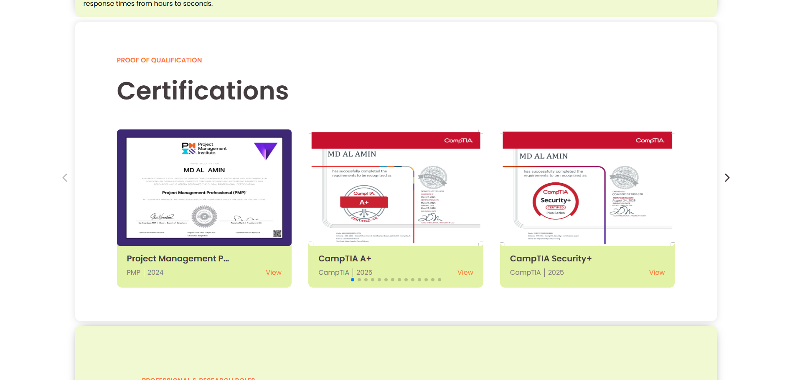
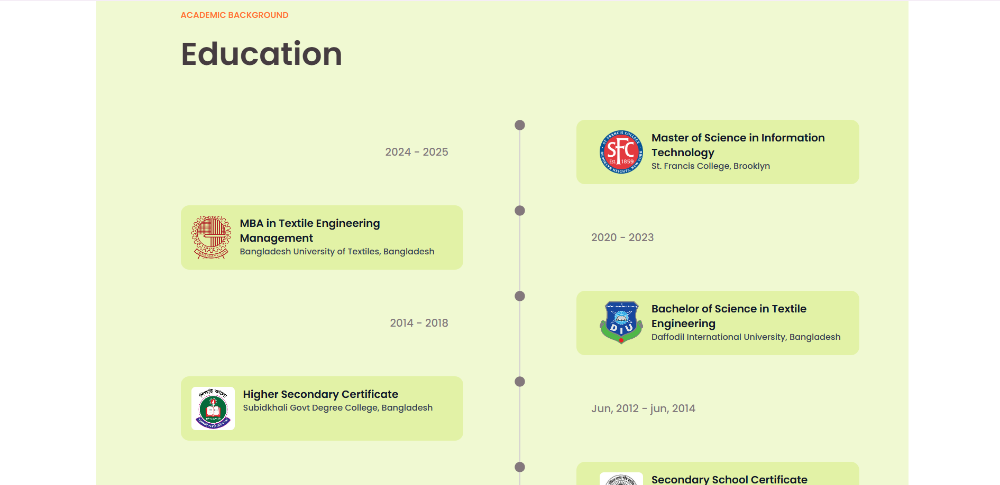
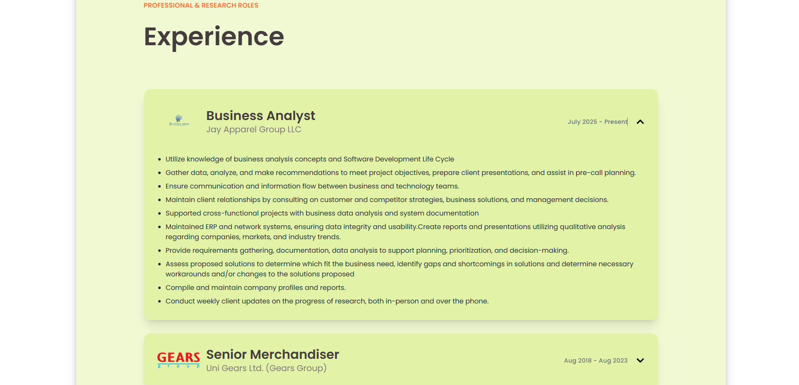

# Alamin's Personal & Professional Portfolio


Welcome to the official repository for Alamin's personal and professional portfolio. This project is a comprehensive digital resume and showcase of skills, experiences, and accomplishments, built with modern web technologies.

<!-- 💡 **Comment for you:** Add your live demo link below! -->

**[Live Demo](https://mdalamin.it.com/)**

## 📸 Desktop View


## ✨ Features

The portfolio is a sleek, single-page application with the following sections:

- **🏠 Home:** An engaging banner with a typed animation introducing Alamin.
- **👨‍💻 About Me:** A brief introduction and professional summary.
- **📜 Certifications:** A showcase of professional certifications.
- **🏢 Experience:** A timeline of work experience presented in an accordion.
- **🏆 Awards:** A collection of awards and memberships.
- **🔬 Researches:** A display of published research and ongoing projects.
- **🎓 Education:** A summary of academic background.
- **🛠️ Skills & Tools:** A detailed list of technical and professional skills with proficiency indicators.
- **🖼️ Portfolio:** A gallery of selected projects.
- **📞 Contact:** A form to get in touch.

## 🚀 Technologies Used

- **Frontend:** React.js, Vite, Tailwind CSS
- **Libraries:**
  - `react-icons` for a rich set of icons.
  - `react-typed` for the engaging text animation on the banner.
  - `swiper` for creating smooth and responsive carousels.
  - `react-responsive-modal` for accessible and clean modals.

## 🖼️ Section Previews

Here are some glimpses of the different sections of the portfolio:

| Certifications                                | Education                             |
| --------------------------------------------- | ------------------------------------- |
|  |  |

| Experiences                                       | Researches                             |
| ------------------------------------------------- | -------------------------------------- |
|  |  |

## ⚙️ Getting Started

Follow these instructions to set up and run the project on your local machine.

### Prerequisites

Make sure you have the following installed:

- [Node.js](https://nodejs.org/en/) (v18.x or higher recommended)
- [npm](https://www.npmjs.com/) (or yarn)

### Installation

1.  **Clone the repository:**

    ```sh
    git clone https://github.com/Mahmudulislamshuvo/alamin-vai-portfolio
    ```

    <!-- 💡 **Comment for you:** Remember to change `your-username/your-repository-name` to your actual repository URL! -->

2.  **Navigate to the project directory:**

    ```sh
    cd alamin-vai-portfolio
    ```

3.  **Install dependencies:**
    ```sh
    npm install
    ```

### Running the Project

- **To start the development server:**

  ```sh
  npm run dev
  ```

  The application will be available at `http://localhost:5173` (or another port if 5173 is busy).

- **To build the project for production:**

  ```sh
  npm run build
  ```

  The optimized static files will be generated in the `dist` folder.

- **To preview the production build locally:**
  ```sh
  npm run preview
  ```

## 📂 Project Structure

The project follows a component-based architecture for easy maintenance and scalability:

```
alamin-vai-portfolio/
├── public/              # Static assets (images, icons)
├── src/
│   ├── assets/          # Project-specific assets
│   ├── components/      # Reusable React components for each section
│   │   ├── AboutMe/
│   │   ├── Archivement/
│   │   ├── Awards/
│   │   └── ...
│   ├── App.jsx          # Main application component
│   ├── main.jsx         # React entry point
│   └── index.css        # Global styles
├── .gitignore
├── index.html           # HTML entry point
├── package.json
├── vite.config.js       # Vite configuration
└── README.md
```

## 🤝 Contact

<!-- 💡 **Comment for you:** Add Alamin's contact information here! -->

**Mahmudul Islam**

- **LinkedIn:** [linkedin.com/in/mahmudul-islam-shuvo/](https://www.linkedin.com/in/mahmudul-islam-shuvo/)
- **GitHub:** [github.com/Mahmudulislamshuvo](https://github.com/Mahmudulislamshuvo)
- **Email:** mahmudulislammern@gmail.com
