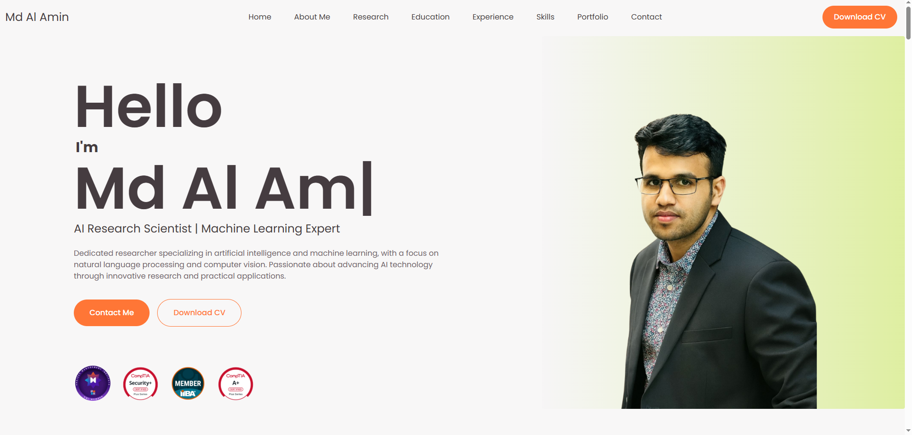
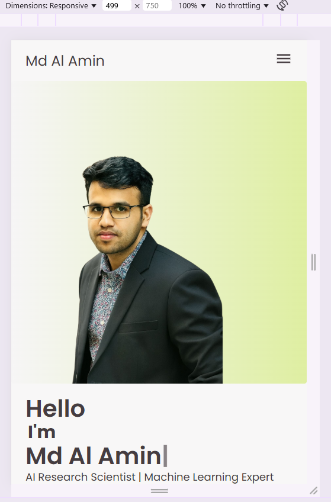
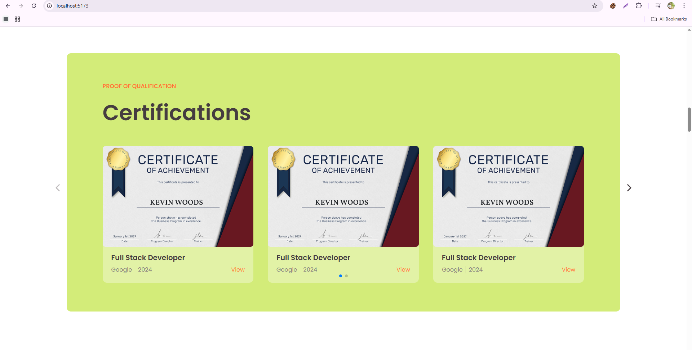
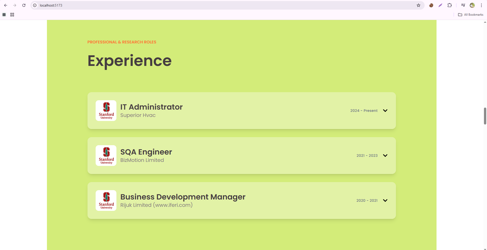
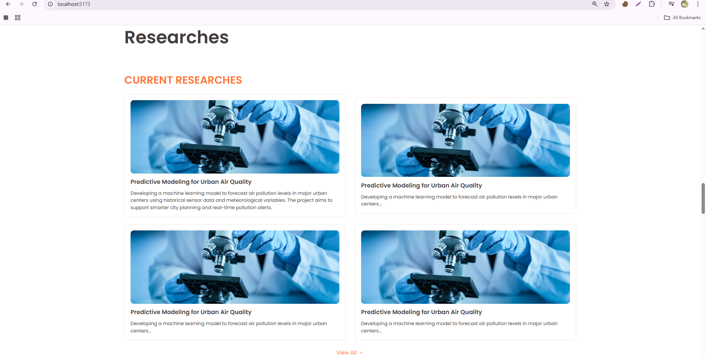
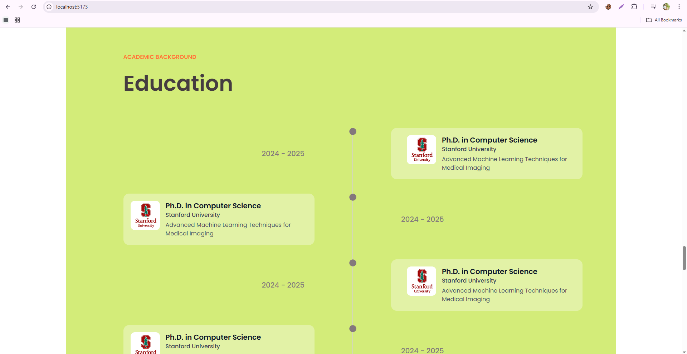

# Portfolio Pro




## Introduction

This is a stunning personal portfolio website built with React and Vite. It's designed to showcase your skills, experience, and projects in a beautiful and engaging way.

## Features

- **Modern Design:** A clean and modern design that is sure to impress.
- **Responsive:** The portfolio is fully responsive and looks great on all devices.
- **Customizable:** Easily customize the portfolio to match your personal brand.
- **Sections for Everything:** Includes sections for your about me, skills, experience, education, projects, and contact information.
- **Engaging Animations:** Subtle animations to make the portfolio more engaging.

## Technologies Used

- **React:** A JavaScript library for building user interfaces.
- **Vite:** A fast and lightweight build tool for modern web projects.
- **HTML5 & CSS3:** The latest web standards for building beautiful and responsive websites.
- **JavaScript:** The programming language of the web.

## Getting Started

To get the project up and running locally, follow these simple steps:

1.  **Clone the repository:**
    ```bash
    git clone https://github.com/your-username/your-repository.git
    ```
2.  **Install the dependencies:**
    ```bash
    npm install
    ```
3.  **Start the development server:**
    ```bash
    npm run dev
    ```
4.  **Open your browser and navigate to `http://localhost:5173/`**

## Screenshots






## Contact

- **Email:** mahmudulislammern@gmail.com
- **LinkedIn:** https://www.linkedin.com/in/mahmudul-islam-shuvo/
- **GitHub:** https://github.com/Mahmudulislamshuvo
